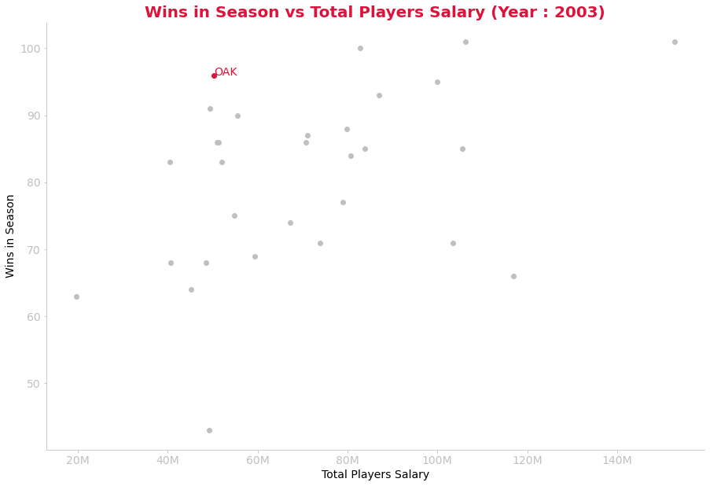

# Moneyball
## Winning Against all Odds Using Statistics

### The Story

After ending their season by loosing  against the Yankees in 2001 MLB playoffs, the Oakland A's loses several key players. Billy Beane begin the negotioations for replacement players hoping to build a competittive team. However, the teams bedget for payroll is very limited compared to other teams. 
<sup>1</sup>   

During a visit to the Cleveland Indians, Billy meets Peter Brand, a Yale economics graduate that has radical ideas about assessing players value. After a conversation with Peter and sensing the opportunity, Beane hires Peter and they assemble together a team using statiscal analysis of players performance. 
<sup>1</sup> 

The strategy is simple : **using statistical analysis to buy assets (players) that are undervalued by other teams ans selling ones that are overvalued by other teams**.
<sup>2</sup> 

This strategy now known as *Moneyball* popularised by the movie of the same name produced a winning team with a low budget.

### The Project

In this project, we will visualize the impact of the *Moneyball* strategy on the team's performance (the years 2002 and 2003 more specifically). We will use data from the Sean Lahman's Baseball Database. More specifically the salary and team performance (win vs loss) data. We will use the following methodology to show the effect of the strategy :

1. Get the data.
2. Combine datasets to have the desired information in a single dataframe.
3. Visualize the competitive advantage given by the *Moneyball* strategy.

### Get The Data

##### Salaries of Players


```python
#your code here
import pandas as pd
import requests, zipfile, io

zip_file_url = 'https://github.com/chadwickbureau/baseballdatabank/archive/master.zip'

r = requests.get(zip_file_url)
z = zipfile.ZipFile(io.BytesIO(r.content))
z.extractall(r"C:\Users\deli91358\Desktop\DS\Harvard CS109\Homeworks\HM1 - Exploratory Data Analysis\data")
#print('Data extracted')
#print('')
salaries = pd.read_csv(r'C:\Users\deli91358\Desktop\DS\Harvard CS109\Homeworks\HM1 - Exploratory Data Analysis\data\baseballdatabank-master\core\Salaries.csv')
teams = pd.read_csv(r'C:\Users\deli91358\Desktop\DS\Harvard CS109\Homeworks\HM1 - Exploratory Data Analysis\data\baseballdatabank-master\core\Teams.csv')

#print('Salaries')
display(salaries)
#print('Teams')

```


<div>
<style scoped>
    .dataframe tbody tr th:only-of-type {
        vertical-align: middle;
    }

    .dataframe tbody tr th {
        vertical-align: top;
    }

    .dataframe thead th {
        text-align: right;
    }
</style>
<table border="1" class="dataframe">
  <thead>
    <tr style="text-align: right;">
      <th></th>
      <th>yearID</th>
      <th>teamID</th>
      <th>lgID</th>
      <th>playerID</th>
      <th>salary</th>
    </tr>
  </thead>
  <tbody>
    <tr>
      <th>0</th>
      <td>1985</td>
      <td>ATL</td>
      <td>NL</td>
      <td>barkele01</td>
      <td>870000</td>
    </tr>
    <tr>
      <th>1</th>
      <td>1985</td>
      <td>ATL</td>
      <td>NL</td>
      <td>bedrost01</td>
      <td>550000</td>
    </tr>
    <tr>
      <th>2</th>
      <td>1985</td>
      <td>ATL</td>
      <td>NL</td>
      <td>benedbr01</td>
      <td>545000</td>
    </tr>
    <tr>
      <th>3</th>
      <td>1985</td>
      <td>ATL</td>
      <td>NL</td>
      <td>campri01</td>
      <td>633333</td>
    </tr>
    <tr>
      <th>4</th>
      <td>1985</td>
      <td>ATL</td>
      <td>NL</td>
      <td>ceronri01</td>
      <td>625000</td>
    </tr>
    <tr>
      <th>...</th>
      <td>...</td>
      <td>...</td>
      <td>...</td>
      <td>...</td>
      <td>...</td>
    </tr>
    <tr>
      <th>26423</th>
      <td>2016</td>
      <td>WAS</td>
      <td>NL</td>
      <td>strasst01</td>
      <td>10400000</td>
    </tr>
    <tr>
      <th>26424</th>
      <td>2016</td>
      <td>WAS</td>
      <td>NL</td>
      <td>taylomi02</td>
      <td>524000</td>
    </tr>
    <tr>
      <th>26425</th>
      <td>2016</td>
      <td>WAS</td>
      <td>NL</td>
      <td>treinbl01</td>
      <td>524900</td>
    </tr>
    <tr>
      <th>26426</th>
      <td>2016</td>
      <td>WAS</td>
      <td>NL</td>
      <td>werthja01</td>
      <td>21733615</td>
    </tr>
    <tr>
      <th>26427</th>
      <td>2016</td>
      <td>WAS</td>
      <td>NL</td>
      <td>zimmery01</td>
      <td>14000000</td>
    </tr>
  </tbody>
</table>
<p>26428 rows × 5 columns</p>
</div>


##### Teams Statistics


```python
teams = teams[['yearID', 'teamID', 'franchID', 'Rank', 'W', 'L']]
display(teams)
```


<div>
<style scoped>
    .dataframe tbody tr th:only-of-type {
        vertical-align: middle;
    }

    .dataframe tbody tr th {
        vertical-align: top;
    }

    .dataframe thead th {
        text-align: right;
    }
</style>
<table border="1" class="dataframe">
  <thead>
    <tr style="text-align: right;">
      <th></th>
      <th>yearID</th>
      <th>teamID</th>
      <th>franchID</th>
      <th>Rank</th>
      <th>W</th>
      <th>L</th>
    </tr>
  </thead>
  <tbody>
    <tr>
      <th>0</th>
      <td>1871</td>
      <td>BS1</td>
      <td>BNA</td>
      <td>3</td>
      <td>20</td>
      <td>10</td>
    </tr>
    <tr>
      <th>1</th>
      <td>1871</td>
      <td>CH1</td>
      <td>CNA</td>
      <td>2</td>
      <td>19</td>
      <td>9</td>
    </tr>
    <tr>
      <th>2</th>
      <td>1871</td>
      <td>CL1</td>
      <td>CFC</td>
      <td>8</td>
      <td>10</td>
      <td>19</td>
    </tr>
    <tr>
      <th>3</th>
      <td>1871</td>
      <td>FW1</td>
      <td>KEK</td>
      <td>7</td>
      <td>7</td>
      <td>12</td>
    </tr>
    <tr>
      <th>4</th>
      <td>1871</td>
      <td>NY2</td>
      <td>NNA</td>
      <td>5</td>
      <td>16</td>
      <td>17</td>
    </tr>
    <tr>
      <th>...</th>
      <td>...</td>
      <td>...</td>
      <td>...</td>
      <td>...</td>
      <td>...</td>
      <td>...</td>
    </tr>
    <tr>
      <th>2920</th>
      <td>2019</td>
      <td>SLN</td>
      <td>STL</td>
      <td>1</td>
      <td>91</td>
      <td>71</td>
    </tr>
    <tr>
      <th>2921</th>
      <td>2019</td>
      <td>TBA</td>
      <td>TBD</td>
      <td>2</td>
      <td>96</td>
      <td>66</td>
    </tr>
    <tr>
      <th>2922</th>
      <td>2019</td>
      <td>TEX</td>
      <td>TEX</td>
      <td>3</td>
      <td>78</td>
      <td>84</td>
    </tr>
    <tr>
      <th>2923</th>
      <td>2019</td>
      <td>TOR</td>
      <td>TOR</td>
      <td>4</td>
      <td>67</td>
      <td>95</td>
    </tr>
    <tr>
      <th>2924</th>
      <td>2019</td>
      <td>WAS</td>
      <td>WSN</td>
      <td>2</td>
      <td>93</td>
      <td>69</td>
    </tr>
  </tbody>
</table>
<p>2925 rows × 6 columns</p>
</div>


### Combine Datasets

We first get the total salaries paid by each teams for the years available.

##### Total Salaries Paid for each Team


```python
total_team_salaries = salaries.groupby(['teamID', 'yearID']).salary.sum().reset_index()
total_team_salaries
```


<div>
<style scoped>
    .dataframe tbody tr th:only-of-type {
        vertical-align: middle;
    }

    .dataframe tbody tr th {
        vertical-align: top;
    }

    .dataframe thead th {
        text-align: right;
    }
</style>
<table border="1" class="dataframe">
  <thead>
    <tr style="text-align: right;">
      <th></th>
      <th>teamID</th>
      <th>yearID</th>
      <th>salary</th>
    </tr>
  </thead>
  <tbody>
    <tr>
      <th>0</th>
      <td>ANA</td>
      <td>1997</td>
      <td>31135472</td>
    </tr>
    <tr>
      <th>1</th>
      <td>ANA</td>
      <td>1998</td>
      <td>41281000</td>
    </tr>
    <tr>
      <th>2</th>
      <td>ANA</td>
      <td>1999</td>
      <td>55388166</td>
    </tr>
    <tr>
      <th>3</th>
      <td>ANA</td>
      <td>2000</td>
      <td>51464167</td>
    </tr>
    <tr>
      <th>4</th>
      <td>ANA</td>
      <td>2001</td>
      <td>47535167</td>
    </tr>
    <tr>
      <th>...</th>
      <td>...</td>
      <td>...</td>
      <td>...</td>
    </tr>
    <tr>
      <th>913</th>
      <td>WAS</td>
      <td>2012</td>
      <td>80855143</td>
    </tr>
    <tr>
      <th>914</th>
      <td>WAS</td>
      <td>2013</td>
      <td>113703270</td>
    </tr>
    <tr>
      <th>915</th>
      <td>WAS</td>
      <td>2014</td>
      <td>131983680</td>
    </tr>
    <tr>
      <th>916</th>
      <td>WAS</td>
      <td>2015</td>
      <td>155587472</td>
    </tr>
    <tr>
      <th>917</th>
      <td>WAS</td>
      <td>2016</td>
      <td>141652646</td>
    </tr>
  </tbody>
</table>
<p>918 rows × 3 columns</p>
</div>


To have the desired information in a single dataframe we join the to tables (yearly salaries by teams and teams performance) using *yearID* and *teamsID* as keys. We the salaries of all the players for a given team and year. 

##### Merged Dataframe Containing Required Information


```python
merge_df = pd.merge(teams, total_team_salaries, on=['teamID','yearID'])
merge_df
```


<div>
<style scoped>
    .dataframe tbody tr th:only-of-type {
        vertical-align: middle;
    }

    .dataframe tbody tr th {
        vertical-align: top;
    }

    .dataframe thead th {
        text-align: right;
    }
</style>
<table border="1" class="dataframe">
  <thead>
    <tr style="text-align: right;">
      <th></th>
      <th>yearID</th>
      <th>teamID</th>
      <th>franchID</th>
      <th>Rank</th>
      <th>W</th>
      <th>L</th>
      <th>salary</th>
    </tr>
  </thead>
  <tbody>
    <tr>
      <th>0</th>
      <td>1985</td>
      <td>ATL</td>
      <td>ATL</td>
      <td>5</td>
      <td>66</td>
      <td>96</td>
      <td>14807000</td>
    </tr>
    <tr>
      <th>1</th>
      <td>1985</td>
      <td>BAL</td>
      <td>BAL</td>
      <td>4</td>
      <td>83</td>
      <td>78</td>
      <td>11560712</td>
    </tr>
    <tr>
      <th>2</th>
      <td>1985</td>
      <td>BOS</td>
      <td>BOS</td>
      <td>5</td>
      <td>81</td>
      <td>81</td>
      <td>10897560</td>
    </tr>
    <tr>
      <th>3</th>
      <td>1985</td>
      <td>CAL</td>
      <td>ANA</td>
      <td>2</td>
      <td>90</td>
      <td>72</td>
      <td>14427894</td>
    </tr>
    <tr>
      <th>4</th>
      <td>1985</td>
      <td>CHA</td>
      <td>CHW</td>
      <td>3</td>
      <td>85</td>
      <td>77</td>
      <td>9846178</td>
    </tr>
    <tr>
      <th>...</th>
      <td>...</td>
      <td>...</td>
      <td>...</td>
      <td>...</td>
      <td>...</td>
      <td>...</td>
      <td>...</td>
    </tr>
    <tr>
      <th>913</th>
      <td>2016</td>
      <td>SLN</td>
      <td>STL</td>
      <td>2</td>
      <td>86</td>
      <td>76</td>
      <td>143053500</td>
    </tr>
    <tr>
      <th>914</th>
      <td>2016</td>
      <td>TBA</td>
      <td>TBD</td>
      <td>5</td>
      <td>68</td>
      <td>94</td>
      <td>57097310</td>
    </tr>
    <tr>
      <th>915</th>
      <td>2016</td>
      <td>TEX</td>
      <td>TEX</td>
      <td>1</td>
      <td>95</td>
      <td>67</td>
      <td>176038723</td>
    </tr>
    <tr>
      <th>916</th>
      <td>2016</td>
      <td>TOR</td>
      <td>TOR</td>
      <td>2</td>
      <td>89</td>
      <td>73</td>
      <td>138701700</td>
    </tr>
    <tr>
      <th>917</th>
      <td>2016</td>
      <td>WAS</td>
      <td>WSN</td>
      <td>1</td>
      <td>95</td>
      <td>67</td>
      <td>141652646</td>
    </tr>
  </tbody>
</table>
<p>918 rows × 7 columns</p>
</div>


### Visualize the Competitive Advantage

Since the goal in baseball is to win games. It is probably a good idea to look at the games won in the season. To see the effect of the *Moneyball* strategy, we will plot wins for each team and the total salaries paid. The optimal result would be to win more games when paying less for players. 

The charts below for years 2002 and 2003 show the result of the Oakland A's competitive advantage.


```python
import matplotlib.pyplot as plt
import matplotlib.ticker as ticker

background_color = 'silver'
level1 = 'black'
contrast = 'crimson'
years = range(2002, 2004)

for year in years:
    
    x = merge_df.salary[(merge_df.yearID == year) & (merge_df.teamID != 'OAK')] / 1000000
    x2 = merge_df.salary[(merge_df.yearID == year) & (merge_df.teamID == 'OAK')] / 1000000
    y = merge_df.W[(merge_df.yearID == year) & (merge_df.teamID != 'OAK')]
    y2 = merge_df.W[(merge_df.yearID == year) & (merge_df.teamID == 'OAK')]
    n = merge_df.teamID[merge_df.yearID == year]

    fig, ax = plt.subplots(figsize=(15, 10))
    ax.scatter(x, y, c=background_color)
    ax.scatter(x2, y2, c=contrast)
    plt.rc('xtick',labelsize=14)
    plt.rc('ytick',labelsize=14)
    
    fig.patch.set_facecolor('white')
    ax.spines['bottom'].set_color(background_color)
    ax.spines['top'].set_color('white') 
    ax.spines['right'].set_color('white')
    ax.spines['left'].set_color(background_color)
    
    ax.tick_params(axis='x', colors=background_color)
    ax.tick_params(axis='y', colors=background_color)

    ax.yaxis.label.set_color(level1)
    ax.xaxis.label.set_color(level1)
    ax.xaxis.set_major_formatter(ticker.FormatStrFormatter('%0.0f' + 'M'))
    
    plt.title('Wins in Season vs Total Players Salary (Year : '+ str(year) + ')', fontweight='bold', c=contrast, fontsize=20)
    plt.xlabel('Total Players Salary', fontsize=14)
    plt.ylabel('Wins in Season', fontsize=14)

    for i, txt in enumerate(n):
        #print(txt)
        
        print('')
        if txt != 'OAK':
            #print(x[i])
            #ax.annotate(txt, (x[i], y[i]), c=background_color)
            continue
        if txt == 'OAK':
            ax.annotate(txt, (x2, y2), c=contrast, fontsize=14)
            
    print('')
    print('')

```

    
    
    
    
    
    
    
    
    
    
    
    
    
    
    
    
    
    
    
    
    
    
    
    
    
    
    
    
    
    
    
    
    
    
    
    
    
    
    
    
    
    
    
    
    
    
    
    
    
    
    
    
    
    
    
    
    
    
    
    
    
    
    
    
    





Looking at the scatter plots above, it is clear that the team was able to perform on a low budget. This suggest that the *Moneyball* strategy was useful in building a great team at a great price!

#### References

<a name="myfootnote1">1</a>: https://www.imdb.com/title/tt1210166/plotsummary

<a name="myfootnote1">2</a>: https://grantland.com/features/the-economics-moneyball/
